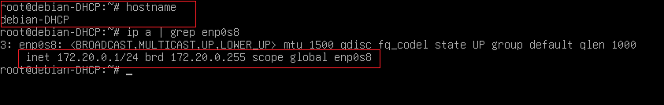
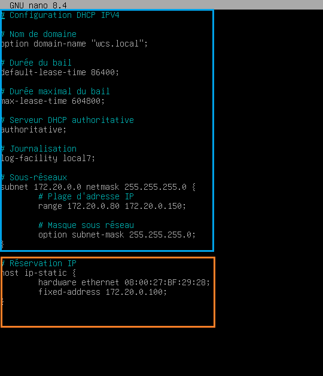
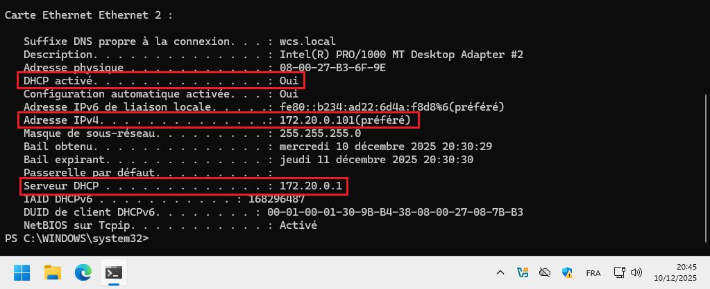
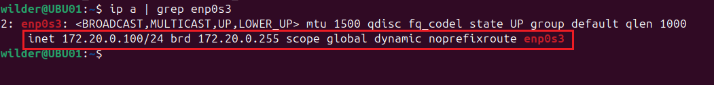

## Solution de quête DHCP avec un Serveur Debian

#### 1) Configuration du serveur Debian avec le nom de la machine debian-DHCP et son adresse ip fixe. 

  

---  

#### 2) Configuration de la plage d'adresse IP pour le DHCP sur le serveur Debian, ainsi que l'adresse réservé pour le client 2.   
  

---  

#### 3) Configuration IP du Client 1 (Windows).   
  

---  

#### 4) Configuration IP du Client 2 (Ubuntu) qui utilise l'adresse IP réservé sur le Serveur Debian.   
  
