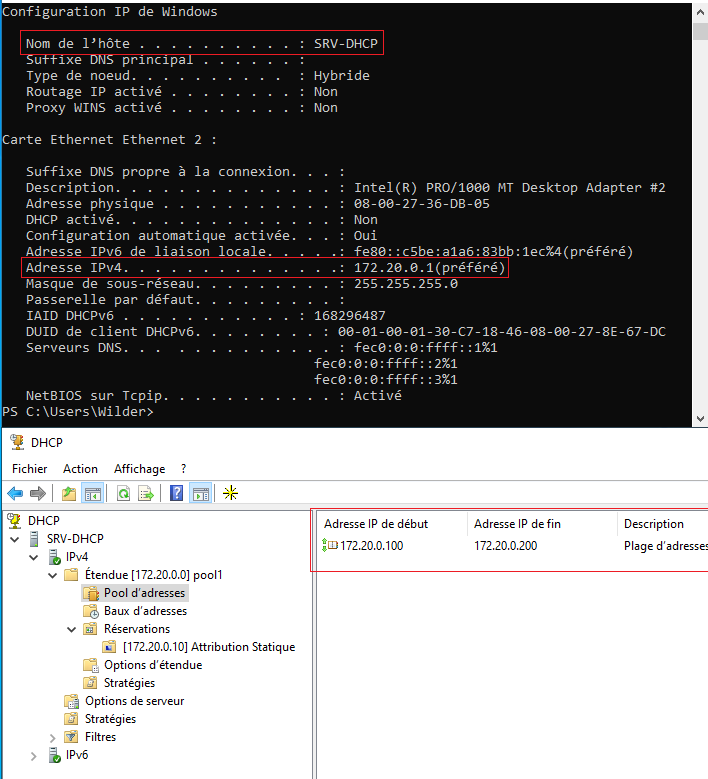
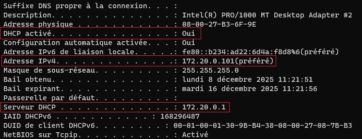
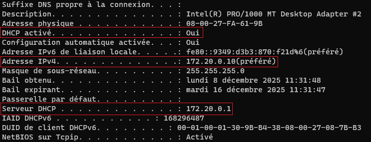
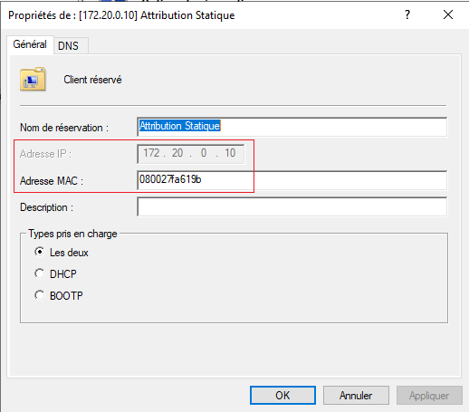

## Solution de quête DHCP avec Windows Server

#### 1) Configuration de Windows Server avec le nom de la machine SRV-DHCP et son adresse ip fixe, ainsi que le pool d'adresse.   

  

---  

#### 2) Configuration IP du premier Client.   
  

---  

#### 3) Configuration IP du deuxième Client.   
  

---  

#### 4) Affichage de la fenêtre de réservation sur le serveur Windows Server.   
  
