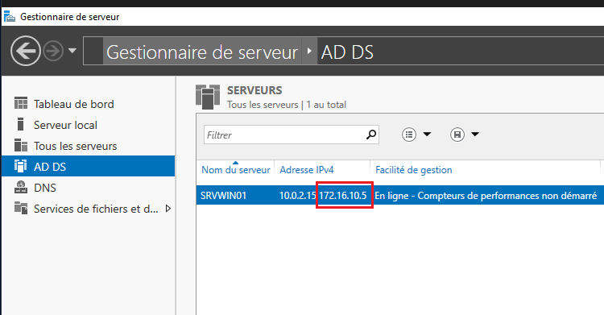
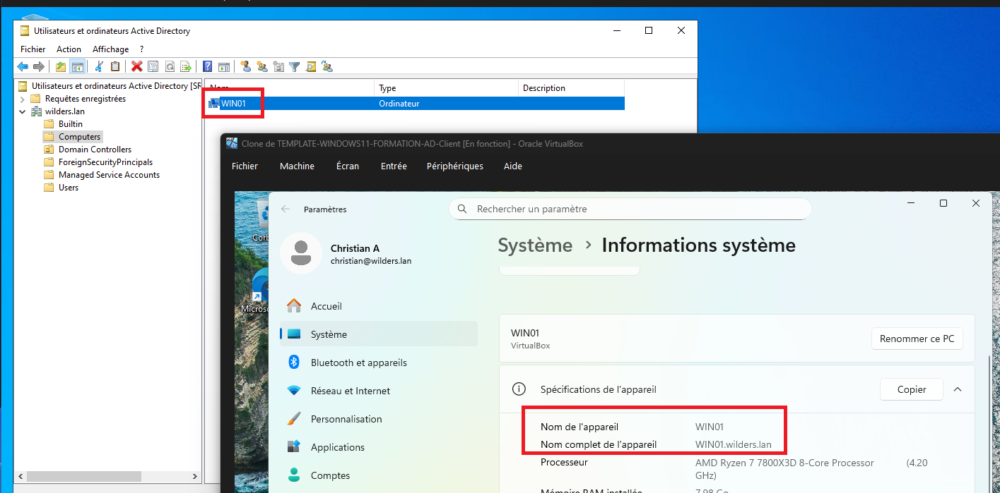

## Active Directory Domain Services - Installation

1) Fenêtre du Server Management avec le Rôle ADDS et l'adresse IP de la machine

---  

2) La console Active Directory Utilisateurs et Ordinateurs où l'on voit le client + un screen du client.

