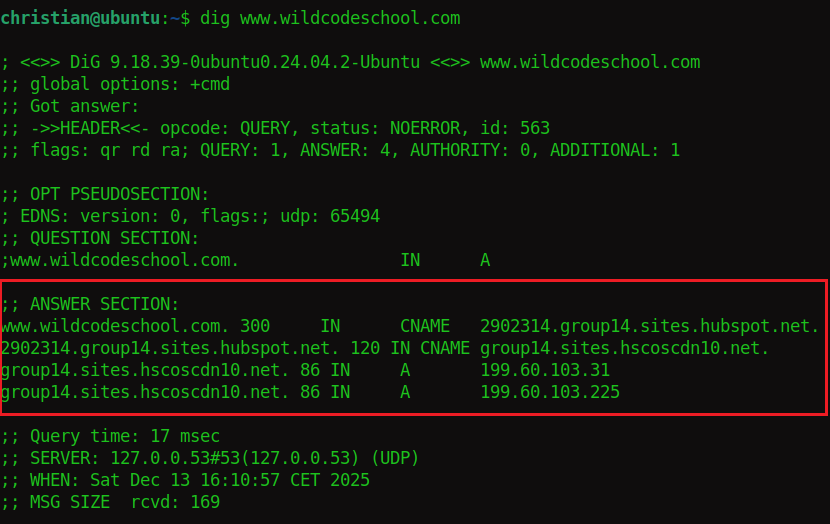
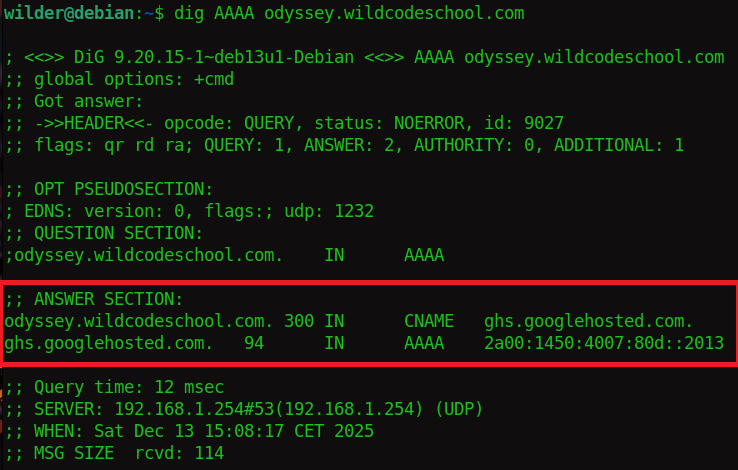
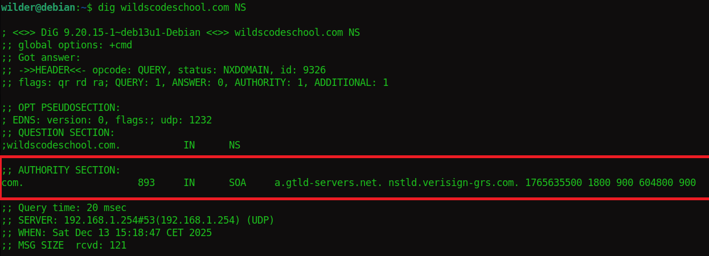
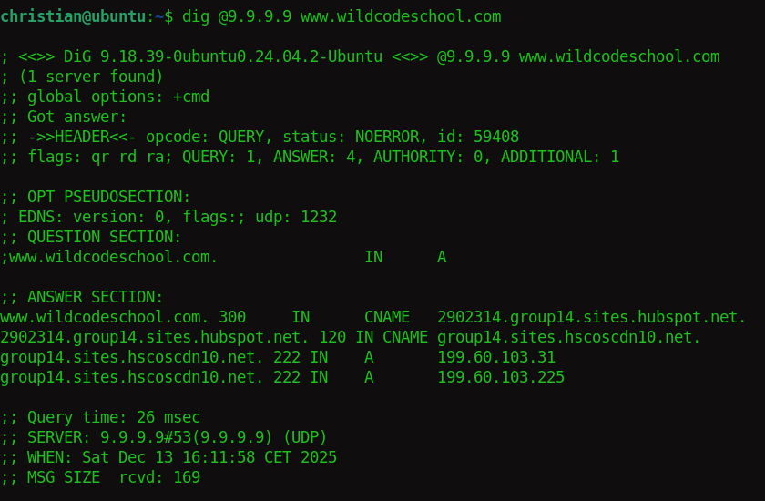
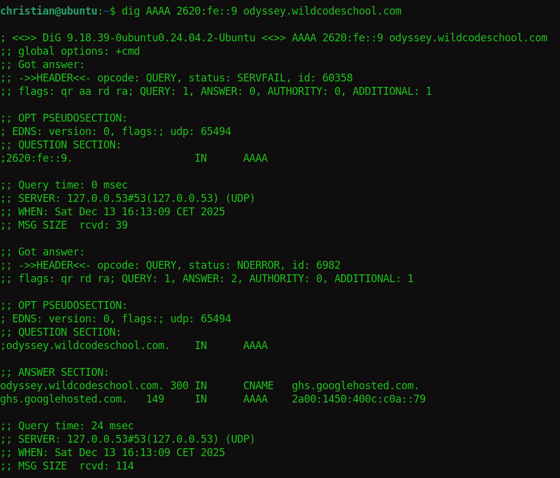

# Solution de quête DNS DIG 

#### 1) Adresse IPv4 du site : www.wildcodeschool.com

   
---  
#### 2) Adresse IPv6 du site : odyssey.wildcodeschool.com

 
---  
#### 3) Nom de serveur d'authorité sur le domaine WCS

 
---  
#### 4) Résultat quad9 IPv4

  

#### 5) Résultat quad9 IPv6

  
