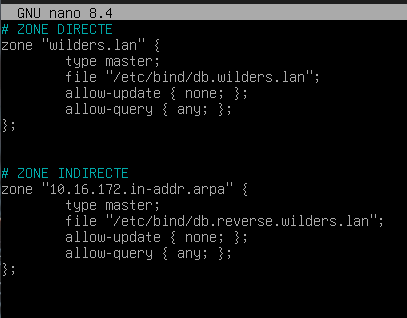
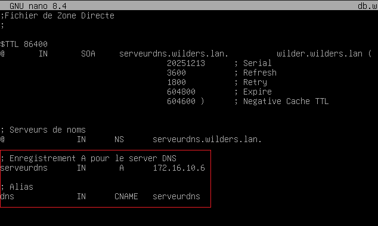
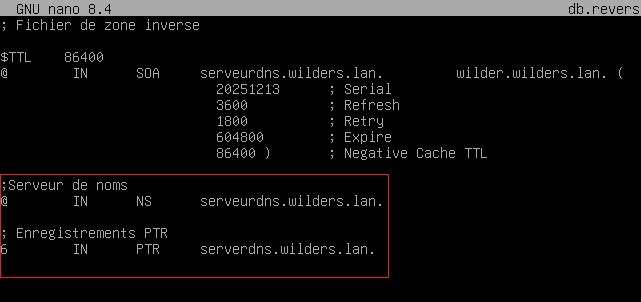
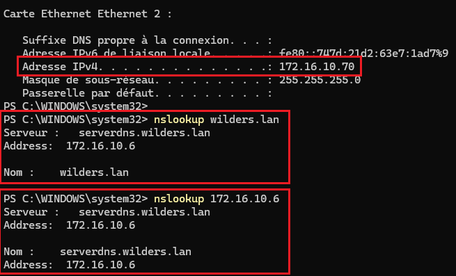

# Solution de quête DNS avec un serveur Debian

#### 1) Configuration du fichier de déclaration des zones

   
---  
#### 2) Configuration du fichier de la **Zone directe** du serveur

 
---  
#### 3) Configuration du fichier de la **Zone indirecte** du serveur

 
---  
#### 4 et 5) Les Résultats de la commande nslookup depuis le client vers le serveur DNS

  

