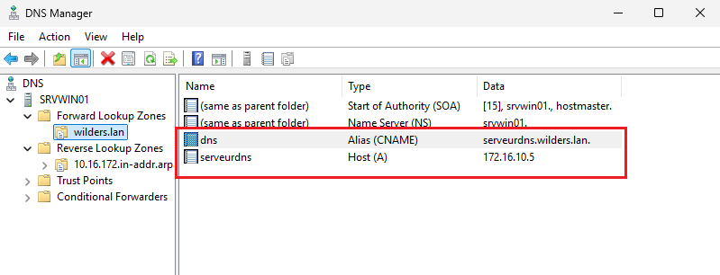
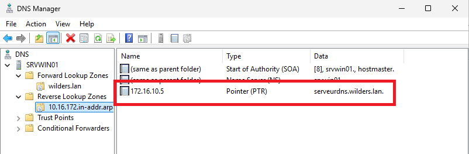
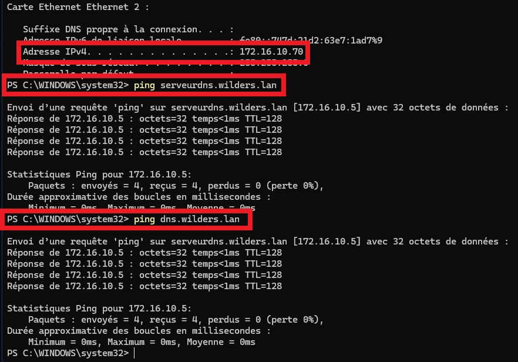
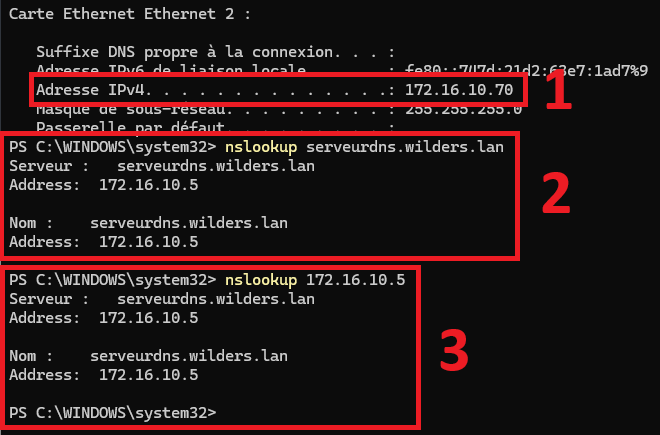

# Solution de quête DNS avec Windows Server

#### 1) Configuration de la **Zone Directe** du serveur

   
---  
#### 2) Configuration de la **Zone Indirecte** du serveur

 
---  
#### 3) Un ping depuis le client vers les 2 noms du serveur

 
---  
#### 4 et 5) Les Résultats de la commande nslookup depuis le client vers le serveur DNS

 
