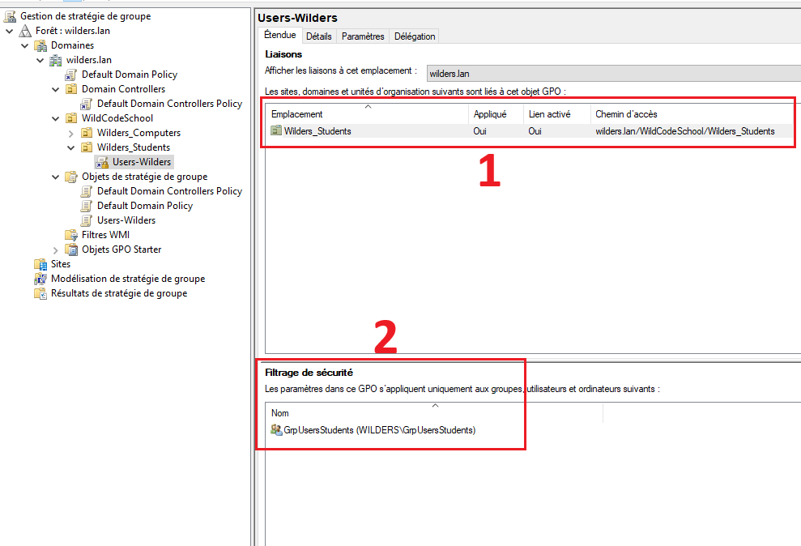
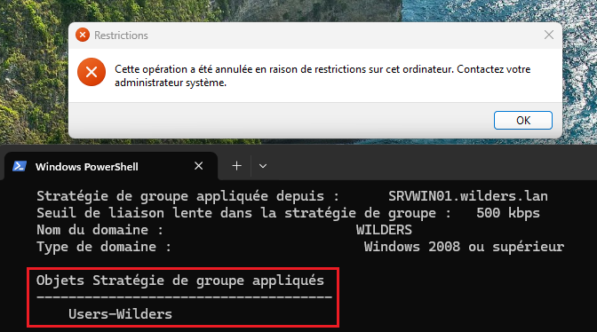

# Quête : Les Stratégies de Groupes ou GPO

1) Fenêtre où l'on voit la GPO appliquée à l'OU *GrpUsersStudents** (1) et le groupe de filtrage (2)

---  

2) Fenêtre indiquant sur le client l'accès refusé au panneau de configuration ainsi que le `gpresult /r`

